# Restaurant Management System Database Schema

This document outlines the complete database structure for the restaurant management system.

```mermaid
%% User Management Section
erDiagram
    %% Core User Management
    Users ||--o{ Orders : "manages/delivers"
    Users ||--o{ CleaningTasks : "performs"
    Users ||--o{ InventoryLogs : "manages"
    Users ||--o{ Shifts : "works"
    Users ||--o{ UserWorkHours : "logs"
    Users ||--o{ Holidays : "requests"
    Users ||--o| BlackListActions : "creates"

    Users {
        uuid id PK "Unique identifier"
        string email UK "Unique email address"
        string password "Hashed password"
        string name "Full name"
        enum role "admin, manager, cook, delivery, cleaner, server"
        timestamp last_login "Last login timestamp"
        boolean is_active "Account status"
        jsonb preferences "User preferences"
        decimal monthly_hours_target "Target working hours"
        timestamp created_at "Account creation date"
        timestamp updated_at "Last update timestamp"
    }

    %% Time Tracking Section
    UserWorkHours {
        uuid id PK "Unique identifier"
        uuid user_id FK "Reference to Users"
        date work_date "Date of work"
        decimal hours_worked "Total hours worked"
        decimal overtime_hours "Overtime hours"
        string month_year "For monthly aggregation (YYYY-MM)"
        boolean is_holiday "Holiday indicator"
        boolean is_sick_leave "Sick leave indicator"
        text notes "Additional information"
        timestamp created_at "Record creation time"
    }

    Holidays {
        uuid id PK "Unique identifier"
        uuid user_id FK "Reference to Users"
        uuid approved_by FK "Reference to Users (manager)"
        date start_date "Holiday start date"
        date end_date "Holiday end date"
        enum status "pending, approved, rejected"
        enum holiday_type "paid_leave, unpaid_leave, sick_leave"
        text reason "Reason for holiday"
        text notes "Additional notes"
        timestamp approved_at "Approval timestamp"
        timestamp created_at "Request creation time"
        timestamp updated_at "Last update timestamp"
    }

    %% Shift Management
    Shifts {
        uuid id PK "Unique identifier"
        uuid user_id FK "Reference to Users"
        timestamp start_time "Shift start time"
        timestamp end_time "Shift end time"
        enum shift_type "morning, afternoon, evening, night"
        boolean is_active "Current shift status"
        decimal break_duration "Break duration in minutes"
        text notes "Shift notes"
        timestamp created_at "Creation timestamp"
        timestamp updated_at "Last update timestamp"
    }

    ShiftTasks {
        uuid id PK "Unique identifier"
        uuid shift_id FK "Reference to Shifts"
        string task_type "Type of task"
        string description "Task description"
        enum status "pending, in_progress, completed"
        timestamp completed_at "Completion timestamp"
        text notes "Task notes"
        timestamp created_at "Creation timestamp"
        timestamp updated_at "Last update timestamp"
    }

    %% Customer Management Section
    Customers ||--o{ Orders : places
    Customers ||--o{ CustomerAddresses : has
    Customers ||--o{ BlackListEntries : "may have"

    Customers {
        uuid id PK "Unique identifier"
        string name "Customer name"
        string phone UK "Unique phone number"
        string email "Email address"
        text notes "Customer notes"
        jsonb preferences "Dietary preferences, etc"
        boolean is_blocked "Blacklist status"
        timestamp last_order "Last order timestamp"
        timestamp created_at "Account creation date"
        timestamp updated_at "Last update timestamp"
    }

    CustomerAddresses {
        uuid id PK "Unique identifier"
        uuid customer_id FK "Reference to Customers"
        string address_line1 "Street address"
        string address_line2 "Additional address info"
        string city "City"
        string postal_code "Postal code"
        boolean is_default "Default address flag"
        text delivery_instructions "Delivery notes"
        timestamp created_at "Creation timestamp"
        timestamp updated_at "Last update timestamp"
    }

    %% Blacklist Management
    BlackListEntries {
        uuid id PK "Unique identifier"
        uuid customer_id FK "Reference to Customers"
        uuid created_by FK "Reference to Users"
        date start_date "Blacklist start date"
        date end_date "Blacklist end date"
        enum severity "low, medium, high"
        text reason "Reason for blacklisting"
        boolean is_active "Current status"
        jsonb evidence "Proof/documentation"
        timestamp created_at "Creation timestamp"
        timestamp updated_at "Last update timestamp"
    }

    BlackListActions {
        uuid id PK "Unique identifier"
        uuid blacklist_entry_id FK "Reference to BlackListEntries"
        uuid performed_by FK "Reference to Users"
        enum action_type "warning, block, unblock"
        text notes "Action notes"
        jsonb action_details "Additional details"
        timestamp created_at "Action timestamp"
    }

    %% Order Management Section
    Orders ||--|{ OrderItems : contains
    Orders ||--o{ Payments : has

    Orders {
        uuid id PK "Unique identifier"
        uuid customer_id FK "Reference to Customers"
        uuid address_id FK "Reference to CustomerAddresses"
        uuid assigned_to FK "Reference to Users"
        enum status "pending, preparing, delivering, completed"
        decimal total_amount "Total order amount"
        jsonb preparation_steps "Order progress tracking"
        timestamp estimated_delivery_time "ETA"
        boolean is_paid "Payment status"
        text notes "Order notes"
        timestamp created_at "Order timestamp"
        timestamp updated_at "Last update timestamp"
    }

    OrderItems {
        uuid id PK "Unique identifier"
        uuid order_id FK "Reference to Orders"
        uuid menu_item_id FK "Reference to MenuItems"
        int quantity "Item quantity"
        jsonb modifications "Customizations"
        decimal unit_price "Price per item"
        string special_instructions "Special requests"
    }

    %% Payment Management
    Payments {
        uuid id PK "Unique identifier"
        uuid order_id FK "Reference to Orders"
        uuid processed_by FK "Reference to Users"
        enum payment_method "cash, card, online"
        enum payment_status "pending, completed, failed"
        decimal amount "Payment amount"
        string transaction_id "External transaction ID"
        jsonb payment_details "Payment information"
        boolean is_refund "Refund indicator"
        uuid refund_for FK "Original payment reference"
        text notes "Payment notes"
        timestamp processed_at "Processing timestamp"
        timestamp created_at "Creation timestamp"
        timestamp updated_at "Last update timestamp"
    }

    %% Menu Management Section
    MenuItems ||--o{ MenuItemIngredients : contains
    MenuItems {
        uuid id PK "Unique identifier"
        string name "Item name"
        string description "Item description"
        decimal price "Item price"
        string category "Item category"
        boolean available "Availability status"
        jsonb preparation_instructions "Cooking instructions"
        string image_url "Item image"
        boolean active "Menu status"
        timestamp created_at "Creation timestamp"
        timestamp updated_at "Last update timestamp"
    }

    MenuItemIngredients {
        uuid id PK "Unique identifier"
        uuid menu_item_id FK "Reference to MenuItems"
        uuid inventory_id FK "Reference to Inventory"
        decimal quantity_required "Required amount"
        string unit "Measurement unit"
    }

    %% Table Management Section
    Tables ||--o{ TableOrders : "has"
    Tables ||--o{ TableReservations : "has"
    Tables ||--o{ TableSections : "belongs to"
    
    Tables {
        uuid id PK "Unique identifier"
        string table_number UK "Unique table number"
        uuid section_id FK "Reference to TableSections"
        int capacity "Seating capacity"
        enum status "free, occupied, reserved, cleaning"
        string qr_code UK "Unique QR code"
        boolean is_active "Table availability"
        point coordinates "Table location coordinates"
        timestamp last_status_change "Last status update"
        timestamp created_at "Creation timestamp"
        timestamp updated_at "Last update timestamp"
    }

    TableSections {
        uuid id PK "Unique identifier"
        string name "Section name"
        string description "Section description"
        int floor_number "Floor level"
        boolean is_smoking "Smoking section"
        boolean is_active "Section availability"
        timestamp created_at "Creation timestamp"
        timestamp updated_at "Last update timestamp"
    }

    TableOrders {
        uuid id PK "Unique identifier"
        uuid table_id FK "Reference to Tables"
        uuid order_id FK "Reference to Orders"
        uuid server_id FK "Reference to Users"
        int guests_count "Number of guests"
        timestamp seated_at "Seating time"
        jsonb seat_numbers "Seat-specific orders"
        boolean is_split_bill "Split bill indicator"
        text special_requests "Special requirements"
        timestamp created_at "Creation timestamp"
        timestamp updated_at "Last update timestamp"
    }

    TableReservations {
        uuid id PK "Unique identifier"
        uuid table_id FK "Reference to Tables"
        uuid customer_id FK "Reference to Customers"
        string customer_name "Guest name"
        string contact_number "Contact information"
        int guests_count "Expected guests"
        timestamp reservation_time "Reserved time"
        int duration_minutes "Expected duration"
        enum status "pending, confirmed, seated, cancelled, no_show"
        text special_requests "Special requirements"
        jsonb deposit_info "Deposit details"
        timestamp created_at "Creation timestamp"
        timestamp updated_at "Last update timestamp"
    }

    %% Inventory Management Section
    Inventory ||--o{ InventoryLogs : tracks
    Inventory {
        uuid id PK "Unique identifier"
        string name "Item name"
        string category "Item category"
        decimal current_stock "Current quantity"
        string unit "Measurement unit"
        decimal minimum_stock "Minimum required"
        decimal reorder_point "Reorder threshold"
        decimal reorder_quantity "Order quantity"
        boolean needs_reorder "Reorder status"
        timestamp created_at "Creation timestamp"
        timestamp updated_at "Last update timestamp"
    }

    InventoryLogs {
        uuid id PK "Unique identifier"
        uuid inventory_id FK "Reference to Inventory"
        uuid user_id FK "Reference to Users"
        enum action_type "addition, deduction, adjustment"
        decimal quantity_changed "Quantity change"
        string reason "Change reason"
        timestamp created_at "Log timestamp"
    }

    %% Announcement System
    Announcements {
        uuid id PK "Unique identifier"
        uuid created_by FK "Reference to Users"
        string title "Announcement title"
        text content "Announcement content"
        date start_date "Display start date"
        date end_date "Display end date"
        enum priority "low, medium, high"
        boolean is_active "Active status"
        boolean requires_acknowledgment "Acknowledgment required"
        jsonb acknowledged_by "Staff acknowledgments"
        timestamp created_at "Creation timestamp"
        timestamp updated_at "Last update timestamp"
    }
```



## Common Usage Examples

### 1. Creating a New Order
```typescript
// Create dine-in order
const order = {
  customer_id: "cust_123",
  status: "pending",
  table_order: {
    table_id: "table_A1",
    guests_count: 4,
    server_id: "server_789",
    seat_numbers: {
      "1": { orders: ["item_1", "item_2"] }
    }
  }
};

// Create delivery order
const deliveryOrder = {
  customer_id: "cust_456",
  address_id: "addr_789",
  status: "pending",
  assigned_to: "delivery_123",
  estimated_delivery_time: "2024-03-15T19:30:00Z"
};
```

### 2. Managing Staff Shifts
```typescript
// Create shift
const shift = {
  user_id: "user_123",
  shift_type: "evening",
  start_time: "2024-03-15T16:00:00Z",
  end_time: "2024-03-16T00:00:00Z",
  tasks: [
    {
      task_type: "cleaning",
      description: "Clean dining area"
    }
  ]
};
```

### 3. Table Reservation
```typescript
// Create reservation
const reservation = {
  table_id: "table_A1",
  customer_name: "John Doe",
  guests_count: 4,
  reservation_time: "2024-03-15T19:00:00Z",
  special_requests: "Birthday celebration"
};
```

## Notes

1. All tables include `created_at` and most include `updated_at` for audit trailing
2. Use UUIDs for all primary keys for better distribution and security
3. Use enums for status fields to ensure data consistency
4. JSONB fields for flexible data storage where needed
5. Proper foreign key constraints for referential integrity

Would you like me to:
1. Add more example queries?
2. Detail specific workflows?
3. Add more relationships between entities?
4. Explain any specific part in more detail?